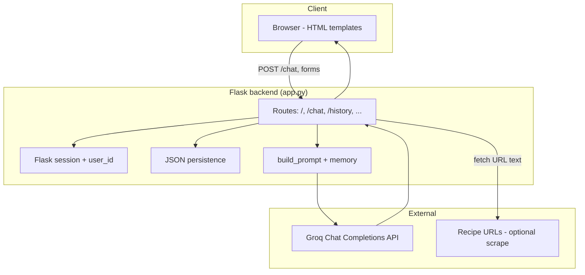

# Course Paper Project Development Report

**Project:** Cheff Mshia — AI Recipe Assistant (Bachelor's Degree / Thesis)  
**Generated:** May 15, 2026  
**Evidence sources:** Agent transcripts in Cursor projects `c-Users-User-OneDrive-recipe`, `c-Users-User-OneDrive-mshia`, and corroborating code at `mshia` and `recipe` project folders.

---

## Executive Summary

You are building a **Python-based recipe assistant** for a bachelor's degree project. The work evolved in two related directions:

1. **Early prototype** (`recipe` folder): FastAPI + SQLite + TheMealDB — ingredient-based recipe search, save, and feedback.
2. **Main deliverable** (`mshia` / **Cheff Mshia**): Flask + Groq LLM — conversational AI recipe chatbot with Georgian/English support, chat history, favorites, persistent memory, and public deployment.

The main app is live on **Render** (free tier), code on **GitHub** (`https://github.com/tamtik0/cheff-mshia`). Development focused heavily on UX (language, scroll, mobile), reliability (API errors, save favorites), privacy (per-user data), and documentation for your thesis write-up.

---

## Project Goals

### Original vision

A Python app where users:

| Area | Requirement |
|------|-------------|
| **Core** | Enter fridge ingredients → get recipe suggestions with nutrition (calories, protein, fat) |
| **Basic** | Save recipes, give feedback |
| **Advanced** | Search history, post/share recipes, comments, weekly meal plans |
| **Diet** | Allergies, dislikes, vegetarian/fasting filters, daily calorie targets |
| **AI** | Built-in chatbot (“something sweet with eggs, milk, no bake”) |
| **APIs** | External recipe data (user wanted free/unlimited; discussed realistic limits) |
| **Accounts** | Simple or none for MVP; secure if users upload content |
| **Platforms** | Web + mobile; public URL (not localhost) |
| **Approach** | Basic version first, then advanced features |

### Realistic constraints agreed in chat

- No truly **free unlimited** recipe/nutrition API — use **TheMealDB** (free, no key) + **caching**, optional **USDA/Edamam** for nutrition.
- **ML not required** for core matching (search/filter/rules suffice).
- **Responsive web** can satisfy “mobile” for a degree project.
- **Deployment** via Render/Railway/etc. with GitHub.

### Scope actually built (main project)

The **Cheff Mshia** Flask app delivers:

- AI recipe chat (Groq API)
- Username + session-based flow
- Chat history save/load/delete
- Favorite recipes save/delete
- User memory (corrections, Georgian vocabulary/grammar notes)
- URL recipe import
- Per-user data isolation
- Google Search Console verification meta tag
- Public deployment on Render

**Not yet built** (from original roadmap): full nutrition macros, user accounts with passwords, community recipes/comments, weekly meal planning, calorie-day planner, native mobile app.

---

## Technology Stack & Architecture

### Main application — Cheff Mshia (`mshia`)

| Layer | Technology |
|-------|------------|
| **Language** | Python 3.10+ |
| **Web framework** | Flask 3.0 |
| **CORS** | flask-cors |
| **AI** | Groq API (`llama-3.3-70b-versatile`; earlier `llama-3.1-8b-instant`) |
| **HTTP client** | requests |
| **Config** | python-dotenv (`.env`) |
| **Production server** | gunicorn (Render) |
| **Frontend** | Server-rendered Jinja2 HTML (`templates/`) |
| **Persistence** | JSON files in `backend/data/` |
| **Hosting** | Render (free tier), GitHub (`tamtik0/cheff-mshia`) |

**Dependencies** (`backend/requirements.txt`): Flask, flask-cors, requests, python-dotenv, gunicorn.

### Early prototype — Recipe Assistant (`recipe`)

| Layer | Technology |
|-------|------------|
| **Framework** | FastAPI |
| **Database** | SQLite + SQLAlchemy |
| **External API** | TheMealDB (no API key) |
| **HTTP** | httpx |
| **Frontend** | `static/index.html` (single-page UI) |

### Project structure (main app)

```text
mshia/
├── README.md
├── templates/
│   ├── index.html      # Main chat UI
│   ├── history.html
│   └── favorites.html
└── backend/
    ├── app.py          # All routes + AI logic (~765 lines)
    ├── requirements.txt
    ├── README.md
    ├── .env            # GROQ_API_KEY, SECRET_KEY (local, not in git)
    ├── .gitignore
    ├── test_api.py
    └── data/
        ├── chat_hist.json
        ├── favorites.json
        └── user_memory.json
```

### Architecture & data flow



**Request flow for chat (`POST /chat`):**

1. User submits message via form on `index.html`.
2. Flask validates session (`username`, `user_id`).
3. Load/save user memory (corrections, Georgian learning).
4. Optionally fetch text from URLs in message.
5. Append user message to in-memory `current_sessions[user_id]`.
6. Build system prompt (language, diet, corrections, Georgian facts, page context).
7. Send system prompt + last ~12 messages to Groq.
8. Parse response with `extract_ai_message()`.
9. Append assistant reply; redirect to `/` with formatted HTML messages.

**Storage model:**

- **In-memory:** `current_sessions` — active chat per `user_id`.
- **On disk:** JSON files for history, favorites, long-term memory.
- **Per-user isolation:** `user_id` on saved chats and favorites.

---

## Core Features (with implementation logic)

### 1. AI recipe chat

- **Route:** `POST /chat`
- **Model:** Groq OpenAI-compatible endpoint
- **Context:** Last 12 messages + rich system prompt from `build_prompt()`
- **Output:** Markdown-ish text converted to HTML via `format_response()`

### 2. Language matching (English vs Georgian)

**Problem:** Replies switched to Georgian when dish names used Georgian script.

**Logic (`detect_message_language`):**

1. Explicit phrases win (`in english`, `ინგლისურად`, etc.).
2. Else compare Latin vs Georgian character counts — dominant script wins.
3. System prompt instructs: English question + Georgian dish name → still answer in English.

### 3. Diet / allergy behavior (opt-in only)

**Problem:** Saved preferences forced fasting/vegan/allergy variants on every request.

**Logic (`get_requested_diet`):**

- Fasting/vegan/vegetarian applied **only** if current message explicitly requests it.
- Stored `user_memory` diet/allergy no longer auto-injected into every prompt.

### 4. Conversation memory within a chat

- Previously only the latest message was sent to Groq.
- Fixed: send last **12 messages** so follow-ups like “yes” retain context.

### 5. Recipe correction memory

- **`right_rcp_save()`** / `correcting_stuff()` detect correction intent.
- Saved in `user_memory.json` → `corrected_recipes` (max 50).
- Injected into prompt when subject matches.

### 6. Georgian learning memory

- **`save_geo()`** parses `word = meaning` lines and grammar notes.
- Stored in `georgian_lexicon` (max 300) and `georgian_notes` (max 40).
- Relevant entries injected into system prompt on future chats.

### 7. Recipe URL import

- **`extract_urls()`** + **`get_rcp_url()`** fetch page, strip HTML, pass up to 4000 chars as prompt context.

### 8. Georgian dish factual guardrails

- **`GEORGIAN_DISH_FACTS`** list (e.g. Sulguni → Samegrelo, not Kartli).
- Injected when dish names appear; prompt forbids inventing regional variants.
- Model upgraded to **`llama-3.3-70b-versatile`** for better accuracy.

### 9. Chat history & favorites

| Feature | Routes | Storage |
|---------|--------|---------|
| Save chat | `POST /save_chat` | `chat_hist.json` |
| View history | `GET /history` | Filtered by `user_id` |
| Load chat | `GET /load_chat/<id>` | Restores to `current_sessions` |
| Delete chat | `POST /delete_chat/<id>` | User-scoped delete |
| Save favorite | `POST /save_favorite` | `favorites.json` |
| View/delete favorites | `GET /favorites`, `POST /delete_favorite/<id>` | User-scoped |

### 10. UI enhancements

- Auto-scroll to latest message (`sessionStorage` + bottom anchor + delayed rescroll).
- Multiline auto-growing textarea; Enter sends, Shift+Enter newline.
- Mobile `@media (max-width: 900px)` responsive layout.
- Sidebar “Current Chat” vs header “New Chat” clarified.

### 11. Early prototype — strict pantry matching

- **`ingredient_match.py`**: recipe shown only if **every** recipe ingredient is covered by user's list (water allowlisted).
- Searches TheMealDB for each user ingredient (up to 6), merges, ranks by overlap.

---

## Development Timeline / Phases

| Phase | Work | Why |
|-------|------|-----|
| **0 — Planning** | Bachelor idea scoped; phased roadmap (1–4) | Align thesis scope with beginner Python level |
| **1 — FastAPI prototype** | FastAPI + SQLite + TheMealDB + `static/index.html` | Runnable “ingredients in → recipes out” demo |
| **1b — Strict matching** | `ingredient_match.py`, multi-ingredient search | Recipes using **only** listed ingredients |
| **2 — Main Flask app** | `backend/app.py`, templates, Groq integration | Pivot to AI chatbot as primary thesis artifact |
| **3 — Documentation** | Docstrings, explanation text files | Thesis documentation & learning |
| **4 — Core UX fixes** | Language, scroll, diet opt-in, conversation history | Real user testing feedback |
| **5 — Memory features** | Corrections, URL import, Georgian learning | “Teach” the bot; fix wrong recipes |
| **6 — Bug fixes** | `right_rcp_sav` typo, `save_fav` name collision, sidebar button | Broken save & undefined name errors |
| **7 — GitHub & deploy** | Git push, Render, env vars, mobile CSS, privacy | Public thesis demo |
| **8 — Reliability & accuracy** | `extract_ai_message`, Georgian facts, model upgrade | Production errors & hallucinations |
| **9 — Report** | Development documentation (this file) | Course paper write-up |

---

## Bug & Error Log

| # | Error / Symptom | When | Troubleshooting | Final solution | Lesson |
|---|-----------------|------|-----------------|----------------|--------|
| 1 | `"right_rcp_sav" is not defined` | Calling correction save in `chat()` | Searched for `right_rcp_*` definitions | Renamed call to `right_rcp_save` | Typos break runtime; verify after renames |
| 2 | Save recipe does nothing | Clicking ❤ Save Recipe | Traced `save_fav` usages | **Name collision:** route `save_fav()` overwrote helper `save_fav(recipes)`; renamed route to `save_favorite()` | Python cannot reuse same function name for helper + route |
| 3 | `TemplateNotFound: index.html` | Running Flask locally | Checked template paths vs `render_template` | Flask `template_folder` pointed to `PROJECT_ROOT/templates` | Flask template path must match file layout |
| 4 | GitHub shows only HTML, no Python | After first push | `git ls-tree` showed `backend` as mode `160000` | Removed submodule tracking; `git rm --cached backend`; deleted nested `.git` | Nested git repos appear as empty folders on GitHub |
| 5 | Push rejected: secret detected | Push after fixing submodule | GitHub secret scanning on `test_api.py` | Removed hardcoded Groq key; use `os.getenv("GROQ_API_KEY")`; amend commit; **revoke exposed key** | Never commit API keys |
| 6 | `Invalid header value b'Bearer gsk_...\\n'` on Render | Live app API calls | Checked env var formatting | Re-paste `GROQ_API_KEY` without quotes/newlines/`Bearer ` prefix | Env vars must be raw single-line values |
| 7 | Chat jumps to top after send | After each message | Identified full page reload without scroll restore | `sessionStorage` flag + `scrollChatToBottom()` + bottom anchor + delayed rescroll | Form POST + reload needs explicit scroll handling |
| 8 | Replies in Georgian when user writes English | Georgian dish names in message | Reviewed `detect_message_language` | Dominant-script detection + explicit language phrases + stronger prompt | Single Georgian token ≠ user wants Georgian replies |
| 9 | No conversation memory (“yes” loses context) | Multi-turn chat | Inspected Groq payload | Send last 12 messages, not only latest | LLM needs transcript for follow-ups |
| 10 | Fasting/allergy recipes without asking | General recipe requests | Found `user_memory` injected into every prompt | Diet/allergy only from **current message** via `get_requested_diet()` | Persistent memory ≠ always-on constraints |
| 11 | `choices` error at top of chat; send appears stuck | Mobile + after API errors | Traced `result['choices'][0]` | Added `extract_ai_message()`; handle HTTP ≥400; removed `disabled` on input when `error` set | Never assume API shape; don’t lock UI on error |
| 12 | Wrong Georgian facts (e.g. “Kartli Sulguni”) | Georgian cuisine questions | Prompt-only fix insufficient | `GEORGIAN_DISH_FACTS` + stricter prompt + larger model | LLMs hallucinate; combine prompt + canonical facts |
| 13 | Send button stuck on “Sending…” | After failed/hung submit | Inline `onsubmit` disabled button without recovery | JS timeout re-enables button after 12s | Always provide UI recovery on POST flows |
| 14 | Users could see each other’s chats | Different names on shared host | History/favorites not filtered | Added `user_id` to records; `get_user_history` / `get_user_fav`; disabled name autofill | Display name ≠ security boundary; use session IDs |
| 15 | Sidebar “New Chat” confusing | Clicking sidebar link | Compared sidebar link vs `POST /new_chat` | Renamed sidebar to “Current Chat”; kept header for new chat | Label buttons by actual behavior |
| 16 | FastAPI `/docs` confused user | First run of recipe prototype | Explained two URLs | Added `/` serving `static/index.html` | Separate user UI from API docs |
| 17 | Recipes need extra ingredients | egg, parsley, cheese, milk, salt search | TheMealDB returns meals containing ingredient, not exclusively | Strict pantry filter in `ingredient_match.py` | “Contains” search ≠ “only these ingredients” |

---

## Technical Decisions & Rationale

| Decision | Rationale |
|----------|-----------|
| **Flask + server-rendered HTML** (main app) | Beginner-friendly; single `app.py`; fits chat-with-forms UX; easy Render deploy |
| **FastAPI** (early prototype) | Good for REST + auto `/docs`; taught API-first design before chat pivot |
| **Groq API** | Free tier friendly; supports Georgian; fast inference for chat |
| **JSON file storage** | No DB setup; fine for thesis/demo; documented migration path to DB in README |
| **Session + `user_id` (not full auth)** | Quick multi-user separation on shared host without password complexity |
| **Prompt engineering over fine-tuning** | Cannot “train” Groq model; memory via injected context is thesis-appropriate |
| **TheMealDB for prototype** | Free, no API key; good for ingredient demo; weak for Georgian dishes |
| **Render free tier** | Public HTTPS URL at no cost; acceptable for portfolio with cold-start caveat |
| **Explanation files gitignored** | Personal study notes stay local; repo stays professional |
| **Google site verification in templates** | Enables Search Console on production domain |

---

## Current Status & Next Steps

### Current state

**Cheff Mshia (main):**

- Functional AI recipe chatbot with Groq
- Deployed on Render; repo at `https://github.com/tamtik0/cheff-mshia`
- Features: chat, history, favorites, memory, Georgian/English behavior, mobile layout, per-user privacy
- Documentation: root + backend README, detailed/simple explanation text files (local only)

**Recipe prototype:**

- Phase 1 API + UI with strict pantry matching
- Unclear if merged into main app or remains separate thesis experiment

### Known limitations

- **LLM hallucinations** for Georgian cuisine may persist despite guardrails
- **Form POST + full page reload** for chat (AJAX suggested but not implemented)
- **Render free tier:** cold starts, sleep when idle, resource limits
- **No real nutrition data** in main app yet
- **No registered user accounts** (session-only isolation)
- **JSON storage** not ideal for production scale

### Recommended next steps

| Priority | Item | Notes |
|----------|------|-------|
| High | **AJAX/fetch for `/chat`** | Eliminates scroll/reload issues entirely |
| High | **Nutrition API integration** | USDA FoodData Central or Edamam + `.env` key |
| Medium | **User accounts** | bcrypt/argon2 passwords, JWT or secure sessions |
| Medium | **Merge or document two codebases** | Clarify thesis: chatbot vs ingredient-search app |
| Medium | **`robots.txt` + sitemap.xml** | SEO after Search Console verification |
| Low | **Weekly meal planner + calorie targets** | Phase 3 of original plan |
| Low | **Community features** | Post recipes, comments |
| Ops | **Revoke any exposed Groq keys** | If not already done after leak incident |

---

## Transcript index (Cursor chat sessions)

| Topic |
|-------|
| Bachelor idea, FastAPI Phase 1, pantry matching, UI explanation |
| Code comments, line-by-line explanation files |
| Language, scroll, diet, memory, Georgian learning |
| `right_rcp_sav`, save_fav bug, sidebar button, git update |
| GitHub, TemplateNotFound, Render deploy, mobile, privacy |
| README, Google verification, git push with gitignore |
| `choices` error, stuck chat, Georgian accuracy |
| Report request |

---

*This report reflects agent transcripts and on-disk project files as of May 15, 2026. Conversations outside those Cursor project folders are not included.*
